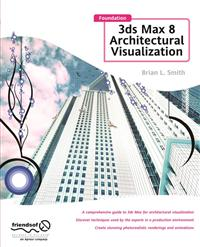

#Apress Source Code

This repository accompanies [*Foundation 3ds Max 8 Architectural Visualization*](http://www.apress.com/9781590595572) by Brian L. Smith (Apress, 2006).

Download the files as a zip using the green button, or clone the repository to your machine using Git.

##Releases

Release v1.0 corresponds to the code in the published book, without corrections or updates.

##Contributions

See the file Contributing.md for more information on how you can contribute to this repository.
